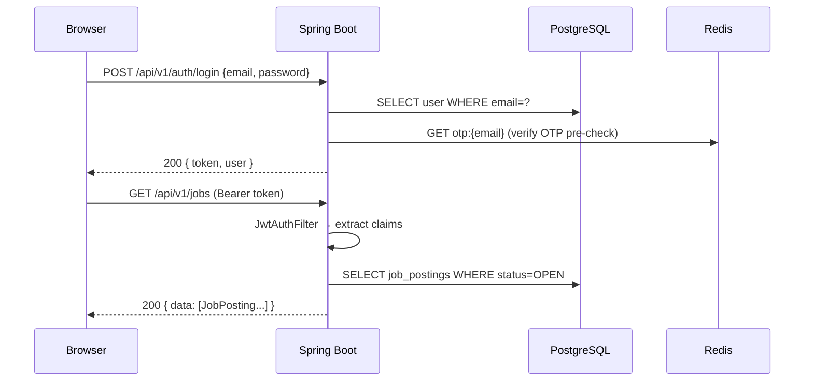
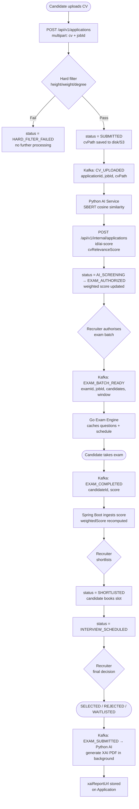
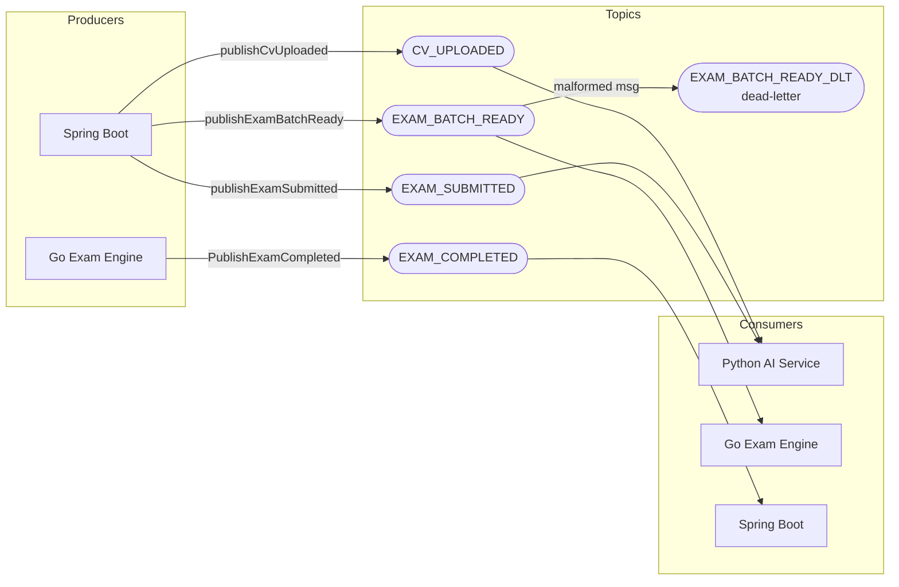
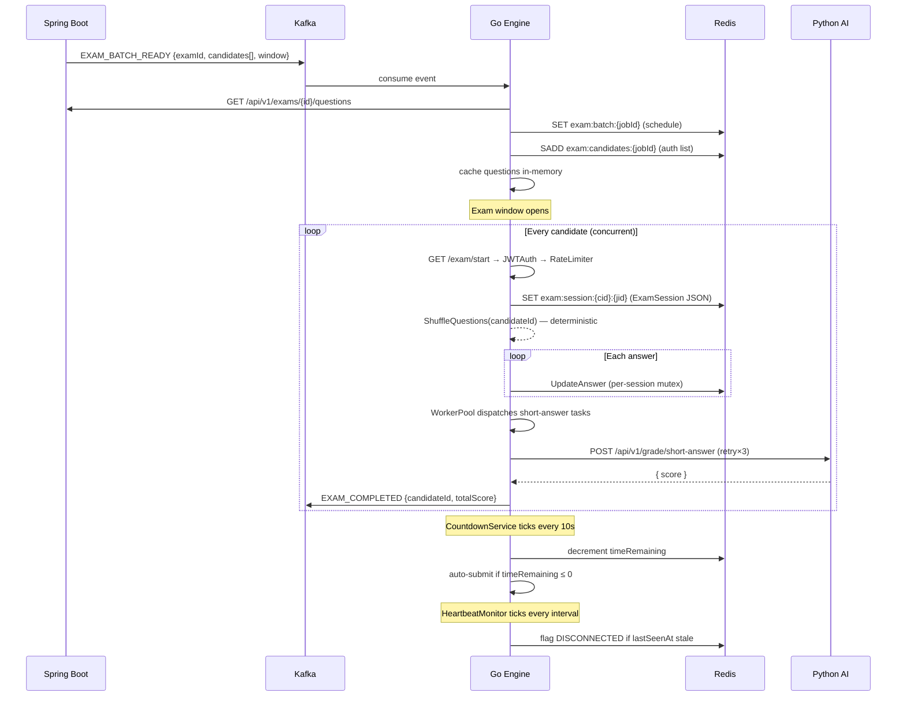
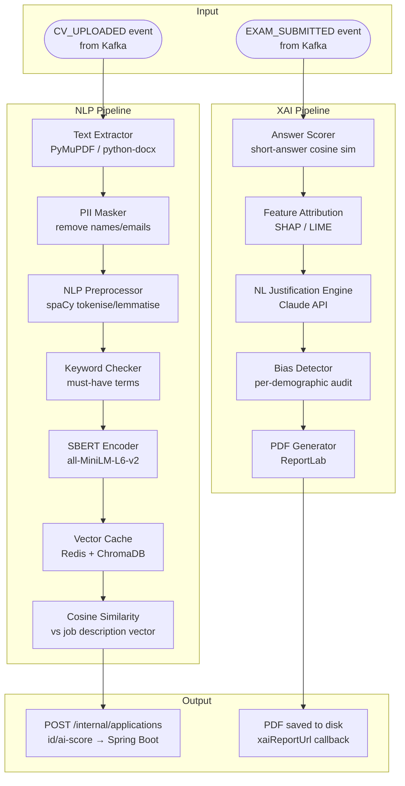
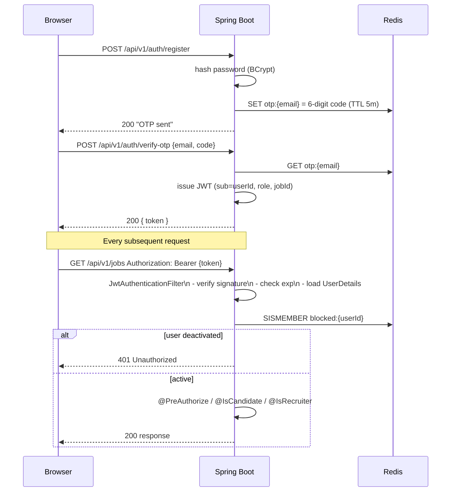
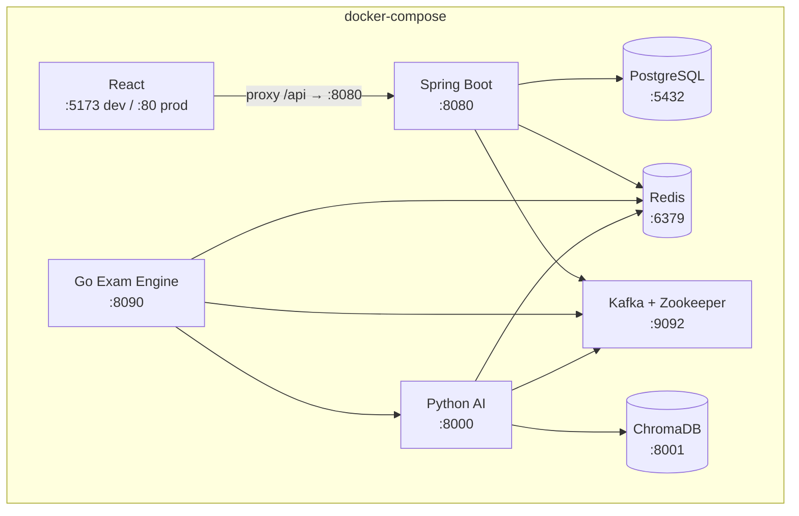

# EAA Recruit — Architecture

## 1. System Overview

Four services communicate over REST and Kafka. PostgreSQL and Redis are shared infrastructure; ChromaDB is owned exclusively by the AI service.

```
┌─────────────────────────────────────────────────────────────────────────┐
│                          Browser / Client                               │
│                   React 18 + TypeScript + Vite                          │
│          (Zustand auth, react-hook-form, Axios interceptors)            │
└────────────────────────────┬────────────────────────────────────────────┘
                             │ HTTPS REST  (Axios → /api/v1/*)
                             ▼
┌─────────────────────────────────────────────────────────────────────────┐
│                    Spring Boot — Core Orchestrator                      │
│                    Java 21 · Gradle · Port 8080                         │
│                                                                         │
│  Controllers   │  Services              │  Repositories                │
│  ─────────────  │  ─────────────────────  │  ──────────────────────────  │
│  Auth           │  CandidateRegistration  │  UserRepository             │
│  Job            │  ApplicationService     │  ApplicationRepository      │
│  Application    │  ExamService            │  JobPostingRepository       │
│  Exam           │  JobService             │  ExamRepository             │
│  Recruiter      │  AvailabilitySlot       │  QuestionRepository         │
│  AdminUser      │  HardFilter             │  AvailabilitySlotRepository │
│  AdminSystem    │  WeightedScoring        │  AuditLogRepository         │
│  Internal       │  FinalDecision          │  AiModelVersionRepository   │
│                 │  SlotBooking            │                             │
│                 │  AuditLog               │                             │
│                 │  SystemHealth           │                             │
└───────┬─────────┴──────────┬─────────────┴────────────┬────────────────┘
        │ JPA/JDBC            │ Kafka topics              │ REST callbacks
        ▼                     ▼                           ▼
┌──────────────┐   ┌──────────────────────┐   ┌─────────────────────────┐
│  PostgreSQL  │   │       Kafka          │   │  Python AI Service      │
│              │   │                      │   │  FastAPI · Port 8000    │
│  users       │   │  CV_UPLOADED    →AI  │   │                         │
│  job_posting │   │  EXAM_BATCH_READY→Go │   │  /cv/score              │
│  application │   │  EXAM_COMPLETED →SB  │   │  /grade/short-answer    │
│  exam        │   │  EXAM_SUBMITTED →AI  │   │  /xai/generate          │
│  question    │   │                      │   │  /health                │
│  avail_slot  │   └──────────┬───────────┘   │                         │
│  audit_log   │              │               │  SBERT embeddings       │
│  ai_model    │   ┌──────────┴───────────┐   │  SHAP/LIME attribution  │
└──────────────┘   │   Go Exam Engine     │   │  PDF report generation  │
                   │   Gin · Port 8090    │   └──────────┬──────────────┘
┌──────────────┐   │                      │              │ reads/writes
│    Redis     │   │  /exam/start         │   ┌──────────┴──────────────┐
│              │◄──│  /exam/submit-answer │   │      ChromaDB           │
│  OTP codes   │   │  /exam/resume        │   │  (vector embeddings)    │
│  JWT blocklist│  │  /exam/heartbeat     │   └─────────────────────────┘
│  ExamSession │◄──│  /health             │
│  RateLimit   │   │                      │
│  VectorCache │◄──│  WorkerPool (×N)     │
└──────────────┘   │  CountdownService    │
                   │  HeartbeatMonitor    │
                   └──────────────────────┘
```

---

## 2. Request / Response Flow — REST

All frontend API calls proxy through `/api/v1/*` to Spring Boot. Axios attaches the JWT in every request; a 401 auto-logs the user out.



---

## 3. Candidate Application Pipeline



---

## 4. Kafka Event Topology



---

## 5. Exam Engine — Concurrent Session Lifecycle



---

## 6. AI Service — CV Scoring & XAI Pipeline



---

## 7. Data Model (Core Tables)

```mermaid
erDiagram
    users {
        bigint id PK
        varchar email UK
        varchar full_name
        varchar role
        boolean active
        timestamp created_at
    }

    job_postings {
        bigint id PK
        varchar title
        text description
        int min_height_cm
        int min_weight_kg
        varchar required_degree
        date open_date
        date close_date
        date exam_date
        varchar status
        bigint created_by FK
    }

    applications {
        bigint id PK
        bigint job_id FK
        bigint candidate_id FK
        varchar status
        varchar cv_path
        float cv_relevance_score
        float exam_score
        boolean hard_filter_passed
        float final_score
        varchar xai_report_url
        text decision_notes
        bigint decision_by_id FK
        bigint interview_slot_id FK
        timestamp submitted_at
    }

    exams {
        bigint id PK
        bigint job_id FK
        int duration_minutes
        date exam_date
        varchar status
    }

    questions {
        bigint id PK
        bigint exam_id FK
        text text
        varchar type
        varchar correct_answer
        float marks
    }

    availability_slots {
        bigint id PK
        bigint recruiter_id FK
        date slot_date
        time start_time
        time end_time
        bigint booked_by_id FK UK
        timestamp booked_at
    }

    audit_logs {
        bigint id PK
        varchar entity_type
        bigint entity_id
        varchar old_status
        varchar new_status
        bigint changed_by_id FK
        varchar reason
        timestamp changed_at
    }

    users ||--o{ job_postings : "recruiter creates"
    users ||--o{ applications : "candidate submits"
    job_postings ||--o{ applications : "receives"
    job_postings ||--o{ exams : "has"
    exams ||--o{ questions : "contains"
    users ||--o{ availability_slots : "recruiter owns"
    users ||--o| availability_slots : "candidate books"
    applications ||--o| availability_slots : "scheduled at"
    applications ||--o{ audit_logs : "tracked by"
```

---

## 8. Redis Key Space

| Pattern | Owner | TTL | Purpose |
|---------|-------|-----|---------|
| `otp:{email}` | Spring Boot | 5 min | OTP verification code |
| `blocked:{userId}` | Spring Boot | until revoked | deactivated user blocklist |
| `exam:session:{cid}:{jid}` | Go Engine | duration + 10 min | live exam state (JSON) |
| `exam:batch:{jobId}` | Go Engine | until window end | exam schedule |
| `exam:candidates:{jobId}` | Go Engine | 48 h | authorized candidate set |
| `ratelimit:candidate:{cid}` | Go Engine | 1 s | sliding rate-limit counter |
| `vec:{sha256(text)}` | Python AI | 1 h | cached SBERT embedding |

---

## 9. Security & Auth Flow



---

## 10. Deployment Topology



---

## Environment Variables Quick Reference

| Service | Key variables |
|---------|--------------|
| Spring Boot | `SPRING_DATASOURCE_URL`, `JWT_SECRET`, `REDIS_HOST`, `KAFKA_BOOTSTRAP_SERVERS` |
| Go Engine | `REDIS_ADDR`, `KAFKA_BROKER`, `SPRING_BASE_URL`, `AI_GRADING_URL`, `WORKER_POOL_SIZE` |
| Python AI | `ANTHROPIC_API_KEY`, `REDIS_URL`, `CHROMA_PATH`, `SPRING_CALLBACK_URL`, `KAFKA_BOOTSTRAP_SERVERS` |
| React | `VITE_API_BASE_URL` (defaults to `/api` via Vite proxy) |
